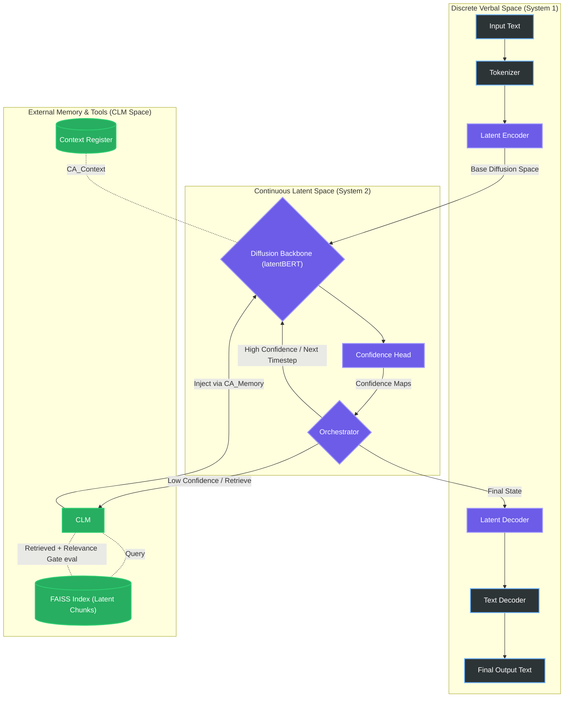

<!-- last_verified: 2026-07-25 -->
# KI: Architecture & Training Phases

## Что это
Высокоуровневое описание архитектуры BEBLaDII (Reasoning Latent Diffusion) Плана B (согласно ADR-037+). Модель реализует дискретную диффузию с мягким латентным якорением, четко разделяя процессы логического анализа (System 2, латентный диффузор `latentBERT`) и лингвистической генерации (System 1, `ModernLatentDecoder` / `Text Decoder`).

## Архитектура и Ключевые компоненты

| Компонент | Класс / Путь | Назначение |
|---|---|---|
| **Tokenizer** | Tokenizer | Преобразует исходный сырой текст в дискретные токены. |
| **Latent Encoder** | `LatentEncoder` / `InputProjector` | Формирует непрерывное базовое пространство диффузии (1024-dim), проектируя входы в латенты. |
| **System 2 Engine** | `DUSModel` (40 layers, ModernBERT) | Итеративное ядро диффузии (`latentBERT`) с AdaLN-блоками и разреженными Cross-Attention слоями. |
| **AdaLN Modules** | AdaLN в составе DUS | Модуляция слоев диффузора по временному шагу $t \in [0, 1]$ и уровню уверенности $c$. |
| **Confidence Head** | `ConfidenceHead` | Легковесная нейросетевая голова, вычисляющая метрику кристаллизации / неопределенности латентов. |
| **Orchestrator** | Orchestrator | Алгоритмический контроллер: управляет циклом диффузии, запросами к CLM и вызовом инструментов. |
| **CLM & Relevance Gate** | `CLM` / `Relevance Gate` | Внешняя фактологическая память с нейронной валидацией релевантности извлеченных чанков. |
| **Context Register** | Operational DB | Операционная строго структурированная база данных (файлы, инструменты), подключаемая через `CA_Context`. |
| **CA_Prompt Layers** | `ModuleList` в DUS | 3 слоя Cross-Attention для инжекции критериев качества промпта пользователя. |
| **CA_Memory Layers** | `ModuleList` в DUS | 3 слоя Cross-Attention для внедрения фактов из CLM. |
| **CA_Context Layers** | `ModuleList` в DUS | 3 слоя Cross-Attention для работы с операционным контекстом. |
| **System 1 (Voice)** | `ModernLatentDecoder` / `Text Decoder` | Неавторегрессионный декодер (3 слоя ModernBERT-large + проекция) для перевода латентов $Z$ в текст. |

## Реализация фаз обучения (6-Phase Pipeline)

В актуальном Плане B принят 6-фазовый пайплайн обучения:

1. **Фаза 1: Latent space creation**: Начальное создание и структурирование латентного диффузионного пространства. Обучение `Latent Encoder` (сферическая топология, $F.normalize$, variance-only KL).
2. **Фаза 2: Decoder training**: Обучение `ModernLatentDecoder` ($Z \to \text{text}$) для восстановления человекочитаемого текста из латентов с сохранением грамматики.
3. **Фаза 3: Base diffusion latentBackbone training**: Обучение основного ядра диффузии (`latentBERT`) на чистом тексте (ADR-061) без `CA_Prompt`. Каноническая диффузия на сфере с AdaLN, косинусным расписанием $\kappa(t)$, вычислением лосса в `float32` и EMA (ADR-045, ADR-057, ADR-059, ADR-060).
4. **Фаза 4: Prompt Conditioning (CA_Prompt)**: Обучение слоев `CA_Prompt` для инжекции промпта пользователя и работы с Canvas-форматом на базе якоря `<|thoughts|>` (ADR-058).
5. **Фаза 5: Memory Integration (CA_Memory)**: Обучение слоев `CA_Memory` подаче фактов из CLM и валидация чанков через `Relevance Gate`.
6. **Фаза 6: Tool Use & Context (CA_Context)**: Обучение слоев `CA_Context` работе с операционным реестром `Context Register`.

## Механизм обусловливания (Conditioning)

В парадигме **Conditional Latent Diffusion** План B использует две схемы инжекции сигналов:
- **Внутреннее обусловливание (AdaLN)**: Временной шаг $t \in [0, 1]$ и значение уверенности $c$ подаются через блоки Adaptive Layer Normalization (AdaLN), модулируя веса промежуточных слоев DUS (ADR-060).
- **Внешнее обусловливание (Cross-Attention)**:
  - `CA_Prompt`: 3 Cross-Attention слоя.
  - `CA_Memory`: 3 Cross-Attention слоя для работы с CLM.
  - `CA_Context`: 3 Cross-Attention слоя для работы с `Context Register`.
  - Все CA-слои используют Gated Residual Connection вида $z_{out} = z_{in} + \sigma(\gamma) \cdot \text{CA}(z_{in}, \text{context})$.

## Plan B: Ключевые архитектурные решения и эволюция

- **Полный отказ от Output Projector (ADR-037)**: Попытка А использовала Output Projector для возврата вектора слоя 40 во входное пространство, что приводило к Garbage Collapse. В Плане B применены Direct Decoding через `ModernLatentDecoder` и Skip Connections.
- **Каноническая диффузия на сфере (ADR-060)**: Использование полного диапазона $t \in [0, 1]$, косинусного расписания $\kappa(t)$, шума на всех токенах и блоков AdaLN.
- **Canvas Format & Clean Text (ADR-058, ADR-061)**: Формат холста с генерируемым якорем `<|thoughts|>` через `LatentEncoder`, переход к диффузии чистых текстов без ChatML-тегов на фундаменте чекпоинта `step_9995`.
- **Численная стабильность (ADR-057, ADR-059)**: Расчет потерь диффузии принудительно переведен в `float32` для устранения взрыва нормы остаточного потока и предотвращения коллапса градиентов `bfloat16`.
- **Pure Targets & Analytical Subtraction (ADR-047, ADR-048)**: Защита от Shortcut Collapse через обучение на чистых таргетах и аналитическое вычитание $c_{embed}$.

## Неочевидные детали и типичные ошибки

- **Mismatch в размерностях**: Токены Qwen2.5 (3584) и ModernBERT (1024). Для сопряжения используется `LatentEncoder`.
- **Заморозка генераторов в eval() (ADR-052)**: Все замороженные генераторы таргетов и энкодеры должны строго находиться в режиме `.eval()`, иначе Dropout вызывает сдвиг распределения.
- **EMA (Exponential Moving Average) (ADR-045)**: Веса диффузора валидируются и инферятся через скользящее среднее EMA для компенсации осцилляций диффузионного лосса.

## Related KIs / ADRs
- [[decisions/037_phase3_failure_and_plan_b_skip_connections.md]] — Переход на План B и Skip Connections.
- [[decisions/045_ema_for_diffusion_stability.md]] — Интеграция EMA для стабильности.
- [[decisions/057_phase3_bfloat16_gradient_collapse.md]] — Фикс коллапса градиентов bfloat16.
- [[decisions/058_phase4_canvas_format_and_sep_token.md]] — Canvas-формат и якорь `<|thoughts|>`.
- [[decisions/059_phase3_residual_stream_norm_explosion.md]] — Устранение взрыва нормы остаточного потока в float32.
- [[decisions/060_phase3_canonical_diffusion_redesign.md]] — Переход к канонической диффузии и AdaLN.
- [[decisions/061_phase3_clean_text_diffusion_transition.md]] — Переход на чистые тексты и чекпоинт step_9995.

## Related KIs

