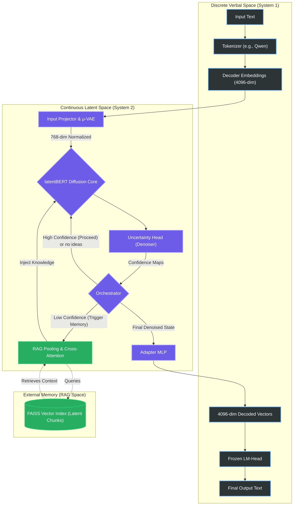

  

<h1 align="center">BEBLaDII</h1>

  
  
  
  
  

# BEBLaDII: Reasoning Latent Diffusion Model

**BEBLaDII** stands for **Bidirectional Encoder Based Latent Diffusion with Information Injection**.

## Purpose
BEBLaDII is an advanced AI model designed to use **Retrieval-Augmented Generation (RAG) directly as its own internal memory**. Unlike standard auto-regressive models that predict the next discrete token, BEBLaDII separates logical reasoning from linguistic generation. It continuously "thinks", doubts its own representations, and iteratively crystallizes meaning inside a continuous latent space. When the model detects high uncertainty in its thoughts, it directly queries external RAG memory to stabilize its latent representations before finally translating them into human-readable text.

## Architecture
BEBLaDII is a discrete diffusion model with soft latent anchoring. The architecture is modular and processes data through four key stages. 

1. **Latent Ingestion (Entry)**
   - **Tokenizer**: Converts input text into embeddings using a frozen decoder vocabulary (e.g., Qwen) to ensure strong baseline linguistic features.
   - **Projector & µ-VAE**: Maps the discrete decoder space into a continuous, Gaussian-friendly **Latent Diffusion Space**. The µ-VAE normalizes the space to prevent diffusion collapse.

2. **Diffusion Core (Reasoning Engine)**
   - **latentBERT**: The core engine is a Depth Up-Scaled ModernBERT (expanded to 40 layers via overlap). Instead of generating tokens sequentially, it acts as a global critic, refining the entire sequence simultaneously over multiple denoising steps.
   - **Uncertainty Head (Denoiser)**: A specialized lightweight neural classifier that evaluates the confidence ($\alpha$) of each latent vector.
   - **Orchestrator**: The control logic module that reads the confidence maps and makes decisive actions (e.g., triggering calls to RAG external memory if uncertainty is high, or continuing the diffusion process).

3. **RAG (External Memory)**
   - **RAG-Pooling**: Compresses a sequence of uncertain diffusion tokens into a highly concentrated vector query.
   - **Index & Cross-Attention**: The system queries a vector database (FAISS) directly in latent coordinates. The retrieved "latent chunks" of knowledge are injected back into the ModernBERT core dynamically via Cross-Attention layers.

4. **Decoder (Output Generation)**
   - **Adapter**: A lightweight MLP that performs the inverse projection, mapping the refined continuous vectors back into the original vocabulary space.
   - **LM-Head**: A frozen language model head translates these final stable vectors into the discrete final text.

## Components
The information flows through the system in a strict sequence. Each component acts as a specialized transformer of data:

1. **Tokenizer (Embedder)**
   - **Base Technology:** Frozen LLM Vocabulary & Embedder (e.g., Qwen 2.5).
   - **Our Changes:** Completely removed the native ModernBERT tokenizer in favor of a much richer multi-lingual LLM tokenizer.
   - **Role:** Converts raw text strings into high-dimensional numerical vectors (e.g., 4096-dim). It acts as the initial discrete linguistic anchor.
   - **I/O:** Receives raw text from the user -> Transmits continuous embeddings to the Input Projector.

2. **Input Projector**
   - **Base Technology:** Multi-Layer Perceptron (MLP).
   - **Our Changes:** Replaces the native embedding layer of ModernBERT to serve as an architectural bridge.
   - **Role:** Geometrically maps vectors from the large decoder space (4096-dim) down into the more compact latent workspace of ModernBERT (768-dim).
   - **I/O:** Receives decoder embeddings -> Transmits 768-dim vectors to the µ-VAE Normalization Head.

3. **µ-VAE Normalization Head**
   - **Base Technology:** Variational Autoencoder (VAE) continuous projection.
   - **Our Changes:** Custom dual linear layers (`mu_head` and `logvar_head`) permanently baked onto the Projector.
   - **Role:** Forces the continuous space to be Gaussian-friendly and suitable for diffusion mechanics. It prevents vectors from instantly collapsing into noise during the forward diffusion process.
   - **I/O:** Receives unnormalized latent vectors -> Transmits stable, normalized diffusion vectors to the ModernBERT Core.

4. **latentBERT (Reasoning Engine)**
   - **Base Technology:** ModernBERT-large.
   - **Our Changes:** Extended from 28 to 40 layers using Depth Up-Scaling (DUS) with overlapping blocks (1-20 and 9-28), effectively increasing reasoning depth without starting from scratch.
   - **Role:** The core iterative diffusion processor. It analyzes the entire sequence of "clouds of meaning" in parallel, applying multi-step denoising refinement based on surrounding semantic context.
   - **I/O:** Receives normalized latent vectors and RAG context -> Transmits conceptually refined latent sequences to the Denoiser.

5. **Uncertainty Head (Denoiser)**
   - **Base Technology:** Lightweight Sigmoid Classifier Head.
   - **Our Changes:** Replaces standard mathematical variance metrics (which are unstable in textual domains) with a trained neural head.
   - **Role:** Calculates the confidence score ($\alpha$) for each latent token, effectively acting as the neural evaluator of certainty.
   - **I/O:** Receives refined vectors from latentBERT -> Transmits confidence maps to the Orchestrator.

6. **Orchestrator**
   - **Base Technology:** Algorithmic control logic (non-neural).
   - **Our Changes:** Custom logic layer acting as the system's executive decision-maker.
   - **Role:** Reads the confidence maps and decides if a concept is ready to crystallize into a word or if it needs external facts to resolve uncertainty. It routes the progression of the diffusion loop.
   - **I/O:** Receives confidence maps from the Uncertainty Head -> Transmits trigger commands to RAG or continues the diffusion loop.

7. **RAG-Pooling & Cross-Attention (Knowledge Injectors)**
   - **Base Technology:** Pooling layer + FAISS Vector Index + Cross-Attention blocks.
   - **Our Changes:** Custom retrieval logic working purely in latent vector spaces, governed by a trainable scalar `gamma` parameter to balance internal thoughts with external facts.
   - **Role:** Pools an uncertain sequence into a single concentrated query, retrieves semantic "latent chunks" of knowledge, and dynamically injects them back into the diffusion process to stabilize hallucinations.
   - **I/O:** Receives doubt-heavy query vectors triggered by the Orchestrator -> Transmits external latent context back into latentBERT.

8. **Mini-RAG (Capabilities Index)**
   - **Base Technology:** The exact same encoder architecture as the main RAG + specific index for tools/tasks.
   - **Our Changes:** A distinct operational memory reserved exclusively for strict contextual data.
   - **Role:** Supplies exact formats and descriptions for available tools, MCP servers, parsed file structures, and other contextual elements necessary for formulating precise tool commands. Because it shares the main RAG encoder, capability vectors can be perfectly compared against semantic query vectors.
   - **I/O:** Receives specific capability queries from the Orchestrator -> Transmits precise context back into latentBERT via CA_Capabilities.

9. **Adapter MLP**
   - **Base Technology:** Multi-Layer Perceptron.
   - **Our Changes:** Custom bridging layer trained via Direct Cross-Entropy.
   - **Role:** The inverse of the Input Projector. Translates the final structured 768-dim latent thoughts back into the specific 4096-dim geometric footprint recognized by the external LLM vocabulary.
   - **I/O:** Receives fully crystallized latent vectors from the final diffusion step -> Transmits 4096-dim vectors to the LM-Head.

10. **LM-Head (Decoder)**
   - **Base Technology:** Frozen LLM Head (e.g., Qwen).
   - **Our Changes:** Entirely frozen and detached from its native transformer blocks.
   - **Role:** Acts as the final discrete linguistic "renderer," decoding the abstract numerical concepts back into human-readable words and sentences.
   - **I/O:** Receives 4096-dim continuous vectors from the Adapter -> Transmits final discrete text output to the user.

## Detailed Component Breakdown

### 1. latentBERT
The core reasoning engine is built on a Depth Up-Scaled ModernBERT, expanding it to 40 layers. The most critical modification is the integration of three distinct types of **Cross-Attention (CA)** modules. Instead of replacing existing layers, these CA modules are inserted parallel to the residual connections, typically starting from the second third of the network's depth (e.g., every second or third layer). The three parallel CA formats are:
- **CA_Prompt:** Continuously embeds the original user prompt or task instruction to maintain strict alignment.
- **CA_Knowledge (Memory):** Injects external factual data retrieved from the main RAG database.
- **CA_Capabilities (Task Context):** Acts as a "Mini-RAG" for tool-use, incorporating active task context, API outputs, or MCP server payloads.

### 2. RAG (External Memory Structure)
The RAG system in BEBLaDII stores more than just standard textual information. To seamlessly interface with the continuous diffusion logic, the database structure is deeply integrated into the latent space. It contains:
- **Text Chunks:** Used for debugging, interpretability, and rebuilding the index if the model is updated.
- **Latent Token Chunks:** Sequences of "ideal" vectors in the diffusion space corresponding to the text.
- **Aggregated Tokens:** Highly concentrated single vectors representing the entire semantic chunk, optimized specifically for rapid similarity search against the RAG-Pooling query output.

### 3. Orchestrator
The Orchestrator is the algorithmic control center. It does not blindly trigger RAG calls the moment a vector shows low confidence. Instead, it analyzes the confidence maps provided by the Uncertainty Head for **specific patterns of uncertainty**—since an entirely uncertain (noisy) vector might just need more internal denoising, whereas a vector oscillating between two conflicting semantic facts is a prime candidate for an external query. Based on these recognized patterns, the Orchestrator intelligently decides:
- Whether to trigger a search in the main RAG database.
- Whether to consult the task-specific Mini-RAG (Capabilities).
- Which specific path the diffusion loop should follow to continue the work.

### 4. Mini-RAG (Capabilities Index)
Unlike the massive general-knowledge main RAG, the Mini-RAG contains strictly relevant, highly-structured task context. This includes the descriptions and exact required formats for available tools, MCP servers, and parsed lists of files and directories. Since it utilizes the exact same encoder configuration as the main RAG, vectors retrieved from the Mini-RAG share the same mathematical space. This allows the Orchestrator to directly compare capability relevance vectors against the model's current active thoughts to perfectly formulate required tool commands.

## Logic of the Operational Spaces
The model achieves "reasoning" by transitioning between continuous shapes of meaning and rigid words, bridging a critical gap through three isolated spaces:

* **Latent Diffusion Space:** A continuous mathematical space where true "thinking" occurs. Rather than operating on exact words, it operates on "clouds of meaning". A vector here might represent a hesitant guess or a soft hypothesis. The vectors are penalized over time for changing, simulating an energy barrier that forces gradual "crystallization" of ideas without locking them in prematurely.
* **RAG Search Space:** The space used for querying external knowledge. Sequence embeddings from the latent diffusion space are pooled together to form a highly specific question vector. It connects the model's internal doubts with pre-calculated, verified "latent chunks" residing in the database.
* **Verbal / Decoding Space:** The discrete linguistic space containing distinct tokens and words from a frozen tokenizer (e.g., Qwen's vocabulary). This space is purely functional—it provides the initial entry constraints and acts as the final "voice" of the model, strictly decoding the crystallized latent thoughts into readable human text at the very last step.

## Temporal Logic & Planning (t-dependent Reasoning)
Because the diffusion process is a progressive refinement over time, `latentBERT` can be trained to implement fundamentally different reasoning strategies at different stages of the denoising cycle, dictated by the time parameter $t$ (or $\tau$). 

Since early stages (large $t$) are characterized by high uncertainty and structural abstraction, the model can be taught to deliberately construct a high-level **Response Plan** during these initial noisy steps. Instead of rushing to define specific concepts, it forms the conceptual scaffolding of the answer first. Only during later steps (small $t$), as the diffusion process cools down, does the model shift its logic from abstract planning to concrete conceptual generation. It iteratively crystallizes these thoughts into highly certain, distinct semantic vectors, remaining entirely within the continuous Latent Space. The system only interacts with the rigid Verbal Space at the very end of the cycle, when the final crystallized vectors are translated into text by the Adapter. This time-dependent logic effectively layers abstract planning and concrete execution within the exact same iterative diffusion loop.

## Implementation Plan
The training lifecycle is divided into five strictly separated phases, moving from basic semantic alignment to complex external memory integration:

**Phase 1: Alignment & DUS (Depth Up-Scaling)**
Extending the ModernBERT architecture to 40 layers and aligning its semantic capacity. We distill abstract logical reasoning from a powerful teacher (e.g., DeepSeek-R1-7B) into the ModernBERT core, ignoring linguistic formatting and focusing purely on matching the latent thought representations. Here we try to give the model the ability to think abstractly and logically.

**Phase 2: Adapter Training (Decoder Bridge)**
Connecting the "intellect" with the "voice". All components are frozen except the Adapter, which is trained via Direct Cross-Entropy to correctly project diffusion vectors into the frozen Qwen LM-head, ensuring perfect textual reconstruction of concepts. Here we try to give the model the ability to speak.

**Phase 3: RAG-Pooling (Semantic Indexing)**
Training the mechanism that forms queries to the external database. We teach the model to reliably compress long latent chunk sequences into robust single query vectors that can successfully identify their related chunks in a FAISS index. Here we try to give the model the ability to remember.

**Phase 4: Denoiser & Iterative Crystallization**
Training the Uncertainty Head (Sigmoid classifier) to accurately predict confidence maps. We additionally train initial Cross-Attention layers to properly integrate the input prompt alongside a trainable `gamma` balancing parameter. During this phase, the model learns to construct a high-level **Response Plan** in the early, noisy steps of the diffusion process (large $t$), and then gradually crystallizes these abstract thoughts into concrete semantic vectors in the later steps (small $t$). Here we try to give the model the ability to plan and to crystallize its thoughts.

**Phase 5: RAG Integration**
The final assembly of the system. Cross-Attention layers are embedded throughout the ModernBERT architecture to dynamically pull in the retrieved latent knowledge chunks exactly when and where the Denoiser flags uncertainty, completing the retrieval-augmented reasoning loop. Here we try to give the model the ability to use its memory.

**Phase 6: Capabilities Integration (Mini-RAG)**
Implementation of the task-specific operational index. The model learns to utilize contextual tool descriptions, MCP server connections, and directory/file structures via the CA_Capabilities layer, enabling precise, context-aware command generation. Here we try to give the model the ability to use tools.

## Citation

> [!IMPORTANT]
> **Mandatory Attribution**
> If you utilize the code in this repository, or if you build upon the core architectural concepts of the **Reasoning Latent Diffusion** framework (System 2 reasoning via iterative latent refinement), **citation is strictly required**. Intellectual credit must be given for both the implementation and the underlying theoretical framework.

Please use the provided [CITATION.cff](CITATION.cff) file or the following metadata:
- **Title**: BEBLaDII: Bidirectional Encoder Based Lathent Diffusion with Information Injection
- **Author**: Bogdan Buliakov
- **URL**: [https://github.com/Laeryid/BEBLaDII](https://github.com/Laeryid/BEBLaDII)
