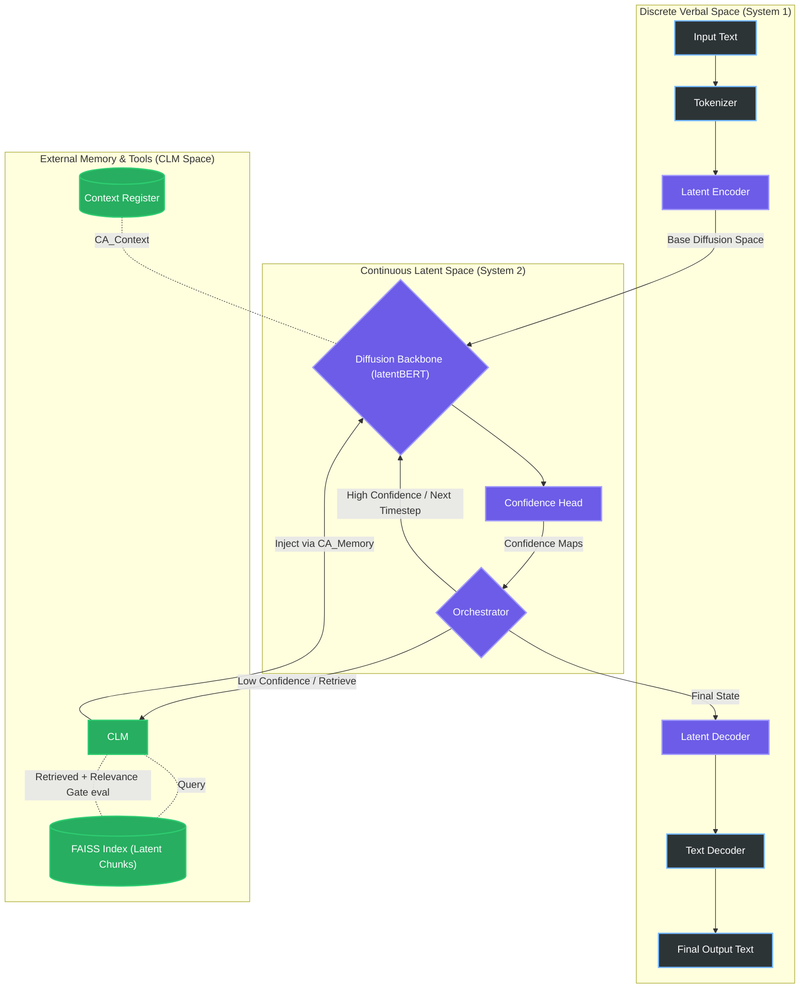

  

<h1 align="center">BEBLaDII</h1>

  
  
  
  
  

# BEBLaDII: Reasoning Latent Diffusion Model

**BEBLaDII** stands for **Bidirectional Encoder Based Latent Diffusion with Information Injection**.

## Purpose
BEBLaDII is an advanced AI model designed to use **Complementary Latent Memory (CLM) directly as its own external memory**. Unlike standard auto-regressive models that predict the next discrete token, BEBLaDII separates logical reasoning from linguistic generation. It continuously "thinks", doubts its own representations, and iteratively crystallizes meaning inside a continuous latent space. When the model detects high uncertainty in its thoughts, it directly queries external CLM memory to stabilize its latent representations before finally translating them into human-readable text via a full text decoder.

## Architecture
BEBLaDII is a discrete diffusion model with soft latent anchoring. The architecture is modular and processes data through its key stages. 

```mermaid
graph TD
    classDef verbal fill:#2d3436,stroke:#74b9ff,stroke-width:2px,color:#fff
    classDef latent fill:#6c5ce7,stroke:#a29bfe,stroke-width:2px,color:#fff
    classDef clm fill:#27ae60,stroke:#2ecc71,stroke-width:2px,color:#fff

    subgraph "Discrete Verbal Space (System 1)"
        A["Input Text"] --> B["Tokenizer"]
        B --> C["Latent Encoder"]
        P["Latent Decoder"] --> J["Text Decoder"]
        J --> M["Final Output Text"]
    end

    subgraph "Continuous Latent Space (System 2)"
        C -->|"Base Diffusion Space"| E{"Diffusion Backbone (latentBERT)"}
        
        E --> F["Confidence Head"]
        
        F -->|"Confidence Maps"| G{"Orchestrator"}
        G -->|"High Confidence / Next Timestep"| E
        G -->|"Final State"| P
    end

    subgraph "External Memory & Tools (CLM Space)"
        TC[("Context Register")] -.-|"CA_Context"| E
        G -->|"Low Confidence / Retrieve"| H["CLM"]
        H -.-|"Query"| I[("FAISS Index (Latent Chunks)")]
        I -.-|"Retrieved + Relevance Gate eval"| H
        H -->|"Inject via CA_Memory"| E
    end

    class A,B,J,M verbal
    class C,E,F,G,P latent
    class H,I,TC clm
```

## Components

1. **Tokenizer**
   - **Role:** Converts raw text strings into discrete tokens.

2. **Latent Encoder**
   - **Role:** Creates the continuous diffusion space. Maps inputs into the continuous latent diffusion representations.

3. **Diffusion Backbone (latentBERT)**
   - **Role:** The core iterative diffusion processor. Processes the entire sequence of "clouds of meaning" in parallel. Interacts with external data via Cross-Attention (CA) modules: `CA_Prompt`, `CA_Memory`, and `CA_Context`.

4. **Confidence Head**
   - **Role:** A lightweight neural evaluator that calculates the confidence score (crystallization metric) for each latent representation.

5. **Orchestrator**
   - **Role:** The algorithmic control center. Routes the diffusion loop progression, requests external knowledge via CLM, switches to tool usage, or triggers time-travel based on confidence maps.

6. **CLM (Complementary Latent Memory)**
   - **Role:** A system of strictly factual external memory. Retrieves representations and evaluates their quality using a neural Relevance Gate.

7. **Context Register**
   - **Role:** An operational, strictly-structured database populated during runtime (tool descriptions, parsed file structures). Accessed by the model via `CA_Context` to ensure precision.

8. **Text Decoder**
   - **Role:** A full text decoder designed for semantic repair. It robustly translates the final latent structures from the diffusion backbone into human-readable, semantically coherent text.

## Training Pipeline

**Phase 1: Latent space creation**
- **Goal**: Initial creation and structuring of the latent diffusion space. Train the Latent Encoder.

**Phase 2: Decoder training**
- **Goal**: Обучение компактного декодера, способного без авторегрессии улучшить грамматику ответа.

**Phase 3: Low-noise latentBackbone training, without CA-prompt**
- **Goal**: Train the core diffusion backbone on low noise settings, focusing on internal consistency without user prompt conditioning (CA-prompt disabled).

**Phase 4: Prompt Conditioning (CA_Prompt)**
- **Goal**: Train `CA_Prompt` layers to inject the rigid quality criteria (the user prompt) directly into the diffusion process.

**Phase 5: Memory Integration (CA_Memory)**
- **Goal**: Train `CA_Memory` layers to inject factual knowledge from CLM, and train the `Relevance Gate` to validate retrieved chunks.

**Phase 6: Tool Use & Context (CA_Context)**
- **Goal**: Train the system to utilize the strictly structured operational `Context Register` via `CA_Context` layers.

## Reports

* Phase 1
  * [Phase 1 Latent space creation](reports\plan_b_phase1_report.md)
* Phase 2
  * [Phase 2 Decoder training](reports\plan_b_phase2_report.md)

### Plan A (failed)
[README Plan A](<experiments\Plan A\README.md>)
* Phase 1
  * [Phase 1 Awakening Report](reports/plan_A/phase1_awakening_report.md)

* Phase 2
  * [Phase 2 Reasoning Report: Failures retrospective](reports/plan_A/phase2_failures_retrospective.md)
  * [Phase 2 Reasoning and Topology Report](reports/plan_A/phase2_reasoning_and_topology_report.md)

* Phase 3
  * [Phase 3 Output projector Report: Failures retrospective](reports/plan_A/phase3_failures_retrospective.md)

## Acknowledgments

This project builds upon the foundational work of the open-source AI community:
* **ModernBERT** (Reasoning engine base architecture) is released under the **Apache 2.0 License**.
* **DeepSeek-R1-Distill-Qwen** (Teacher model for logical distillation) is released under the **MIT License**. The underlying Qwen-2.5 architecture is released under the **Apache 2.0 License**.

Special thanks to:
* **Google** for providing the **Cloud TPU** computational resources that made the large-scale training and distillation of this model possible.
* **Antigravity** (AI IDE) for invaluable pair-programming assistance, debugging, and continuous code generation support throughout the development of BEBLaDII.

## Citation

> [!IMPORTANT]
> **Mandatory Attribution**
> If you utilize the code in this repository, or if you build upon the core architectural concepts of the **Reasoning Latent Diffusion** framework (Latent Diffusion-based reasoning via iterative latent refinement), **citation is strictly required**. Intellectual credit must be given for both the implementation and the underlying theoretical framework.

Please use the provided [CITATION.cff](CITATION.cff) file or the following metadata:
- **Title**: BEBLaDII: Bidirectional Encoder Based Lathent Diffusion with Information Injection
- **Author**: Bogdan Buliakov
- **URL**: [https://github.com/Laeryid/BEBLaDII](https://github.com/Laeryid/BEBLaDII)
