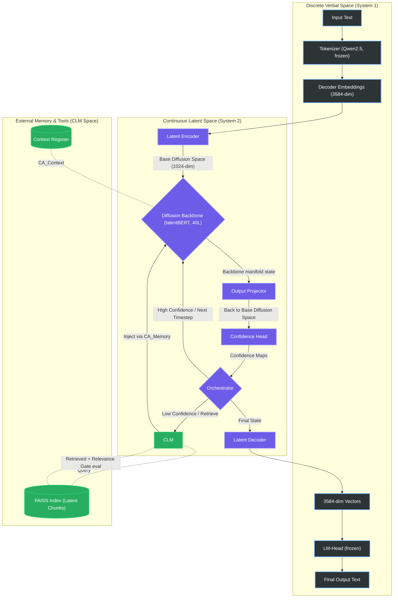

  

<h1 align="center">BEBLaDII</h1>

  
  
  
  
  

# BEBLaDII: Reasoning Latent Diffusion Model

**BEBLaDII** stands for **Bidirectional Encoder Based Latent Diffusion with Information Injection**.

## Purpose
BEBLaDII is an advanced AI model designed to use **Complementary Latent Memory (CLM) directly as its own external memory**. Unlike standard auto-regressive models that predict the next discrete token, BEBLaDII separates logical reasoning from linguistic generation. It continuously "thinks", doubts its own representations, and iteratively crystallizes meaning inside a continuous latent space. When the model detects high uncertainty in its thoughts, it directly queries external CLM memory to stabilize its latent representations before finally translating them into human-readable text.

## Architecture
BEBLaDII is a discrete diffusion model with soft latent anchoring. The architecture is modular and processes data through four key stages. 

```mermaid
graph TD
    classDef verbal fill:#2d3436,stroke:#74b9ff,stroke-width:2px,color:#fff
    classDef latent fill:#6c5ce7,stroke:#a29bfe,stroke-width:2px,color:#fff
    classDef clm fill:#27ae60,stroke:#2ecc71,stroke-width:2px,color:#fff

    subgraph "Discrete Verbal Space (System 1)"
        A["Input Text"] --> B["Tokenizer (Qwen2.5, frozen)"]
        B --> C["Decoder Embeddings (3584-dim)"]
        K["3584-dim Vectors"] --> L["LM-Head (frozen)"]
        L --> M["Final Output Text"]
    end

    subgraph "Continuous Latent Space (System 2)"
        C --> D["Latent Encoder"]
        D -->|"Base Diffusion Space (1024-dim)"| E{"Diffusion Backbone (latentBERT, 40L)"}
        
        E -->|Backbone manifold state| OP["Output Projector"]
        OP -->|"Back to Base Diffusion Space"| F["Confidence Head"]
        
        F -->|"Confidence Maps"| G{"Orchestrator"}
        G -->|"High Confidence / Next Timestep"| E
        G -->|"Low Confidence / Retrieve"| H["CLM"]
        H -->|"Inject via CA_Memory"| E
        G -->|"Final State"| J["Latent Decoder"]
        J --> K
    end

    subgraph "External Memory & Tools (CLM Space)"
        H -.-|"Query"| I[("FAISS Index (Latent Chunks)")]
        I -.-|"Retrieved + Relevance Gate eval"| H
        TC[("Context Register")] -.-|"CA_Context"| E
    end

    class A,B,C,K,L,M verbal
    class D,E,F,G,J,OP latent
    class H,I,TC clm
```

## Components

1. **Tokenizer**
   - **Role:** Converts raw text strings into high-dimensional numerical vectors (3584-dim). It acts as the initial discrete linguistic anchor.

2. **Latent Encoder**
   - **Role:** Maps vectors from the large decoder space down into the normalized Latent Diffusion Space (1024-dim) using a VAE-style projection. Shared with CLM and Context Register.

3. **Diffusion Backbone (latentBERT)**
   - **Role:** The core iterative diffusion processor. Extended to 40 layers via Depth Up-Scaling (DUS). Processes the entire sequence of "clouds of meaning" in parallel. Interacts with external data via three Cross-Attention (CA) modules: `CA_Prompt`, `CA_Memory`, and `CA_Context`.

4. **Output Projector**
   - **Role:** Projects the internal manifold state of the backbone (from layer 40) back to the base Latent Diffusion Space to close the diffusion loop and allow valid confidence metrics.

5. **Confidence Head**
   - **Role:** A lightweight neural evaluator that calculates the confidence score (crystallization metric) for each latent token.

6. **Orchestrator**
   - **Role:** The algorithmic control center. Routes the diffusion loop progression, requests external knowledge via CLM, switches to tool usage, or triggers time-travel based on confidence maps.

7. **CLM (Complementary Latent Memory)**
   - **Role:** A system of strictly factual external memory. Compresses queries via **Pooling**, maps them to an ANN-optimized space via **Index Mapper**, retrieves vectors from a FAISS Index, and evaluates their quality using a neural **Relevance Gate**.

8. **Context Register**
   - **Role:** An operational, strictly-structured database populated during runtime (tool descriptions, parsed file structures). Accessed by the model via `CA_Context` to ensure precision without factual hallucinations.

9. **Latent Decoder**
   - **Role:** Translates the final structured 1024-dim latent thoughts back into the specific 3584-dim geometric footprint recognized by the external LLM vocabulary.

10. **LM-Head**
    - **Role:** The frozen language model head decodes the abstract numerical concepts back into human-readable text.

## Training Pipeline (10 Phases)
The training lifecycle is divided into 10 strict atomic phases to ensure perfect alignment without component interference:

**Phase 1: Awakening**
- **Goal**: Initial semantic alignment. Train the Latent Encoder to map 3584-dim Qwen space to 1024-dim ModernBERT space. (✅ Completed)

**Phase 2: Reasoning**
- **Goal**: DUS Distillation. Distill logical reasoning abilities from a powerful teacher (DeepSeek-R1-7B) into the 40-layer Diffusion Backbone. (🔄 In Progress)

**Phase 3: Output Projection**
- **Goal**: Train the `Output Projector` to bridge the layer-40 internal backbone manifold back to the base Latent Diffusion Space.

**Phase 4: Decoder Bridge**
- **Goal**: Train the `Latent Decoder` to project final crystallized 1024-dim representations back to 3584-dim space.

**Phase 5: CLM Pooling**
- **Goal**: Train the CLM pooling mechanism to compress sequences of uncertain latent tokens into a single concentrated query vector.

**Phase 6: CLM Index Mapper**
- **Goal**: Train the Index Mapper via Contrastive Loss to transform query vectors into an ANN-optimized search space.

**Phase 7: Confidence Sensor**
- **Goal**: Train the Confidence Head on synthetic data (pure vectors, interpolations, noise) to act as a geometrical entropy sensor.

**Phase 8: Prompt Conditioning (CA_Prompt)**
- **Goal**: Train `CA_Prompt` layers to inject the rigid quality criteria (the user prompt) directly into the diffusion process.

**Phase 9: Memory Integration (CA_Memory)**
- **Goal**: Train `CA_Memory` layers to inject factual knowledge from CLM, and train the `Relevance Gate` to validate retrieved chunks.

**Phase 10: Tool Use & Context (CA_Context)**
- **Goal**: Train the system to utilize the strictly structured operational `Context Register` via `CA_Context` layers.

## Reports

* Phase 1
  * [Phase 1 Awakening Report](reports/phase1_awakening_report.md)

## Acknowledgments

This project builds upon the foundational work of the open-source AI community:
* **ModernBERT** (Reasoning engine base architecture) is released under the **Apache 2.0 License**.
* **DeepSeek-R1-Distill-Qwen** (Teacher model for logical distillation) is released under the **MIT License**. The underlying Qwen-2.5 architecture is released under the **Apache 2.0 License**.

Special thanks to:
* **Google** for providing the **Cloud TPU** computational resources that made the large-scale training and distillation of this model possible.
* **Antigravity** (AI IDE) for invaluable pair-programming assistance, debugging, and continuous code generation support throughout the development of BEBLaDII.

## Citation

> [!IMPORTANT]
> **Mandatory Attribution**
> If you utilize the code in this repository, or if you build upon the core architectural concepts of the **Reasoning Latent Diffusion** framework (Latent Diffusion-based reasoning via iterative latent refinement), **citation is strictly required**. Intellectual credit must be given for both the implementation and the underlying theoretical framework.

Please use the provided [CITATION.cff](CITATION.cff) file or the following metadata:
- **Title**: BEBLaDII: Bidirectional Encoder Based Lathent Diffusion with Information Injection
- **Author**: Bogdan Buliakov
- **URL**: [https://github.com/Laeryid/BEBLaDII](https://github.com/Laeryid/BEBLaDII)
