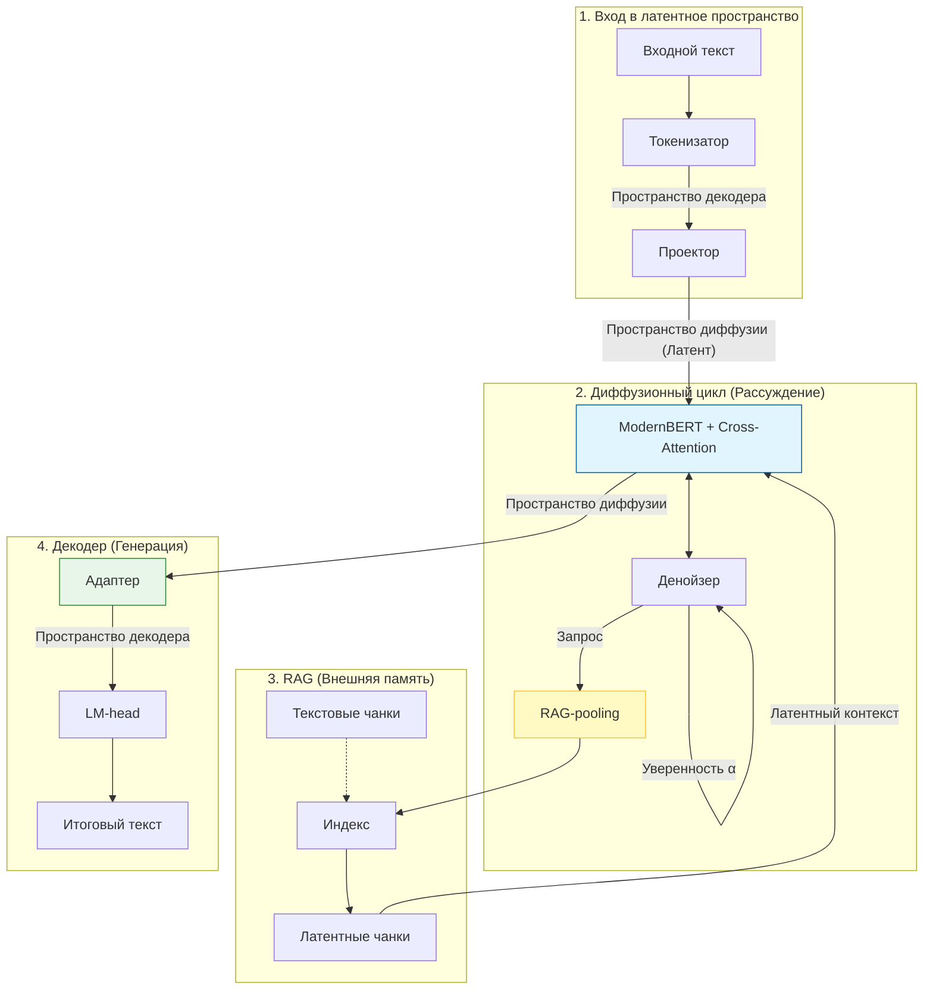

# Архитектура BEBLaDII (Reasoning Latent Diffusion)

BEBLaDII — это модульная система, реализующая принцип «Разумной Диффузии» путем разделения процессов логического анализа (System 2) и лингвистической генерации (System 1). Информация проходит через четыре ключевых этапа: от сырого текста до латентного рассуждения и обратно в текст.

## Визуализация потоков данных



---

## 1. Перевод в латентное пространство

Архитектура начинается с перевода дискретного текста в непрерывное векторное пространство, через которое модель будет «общаться» с внутренними компонентами.

- **1.1. Токенизатор**: Принимает входной текст и переводит его в эмбеддинги, соответствующие пространству замороженного декодера (например, Qwen). Это гарантирует наличие базовых лингвистических признаков на самом старте.
- **1.2. Проектор**: Линейный слой или небольшой MLP, выполняющий трансформацию векторов из **пространства декодера** в **пространство диффузии** (рабочее пространство ModernBERT).

---

## 2. Диффузия (Ядро системы)

Здесь происходят итеративные размышления. Модель не генерирует токены, а уточняет латентные представления всей последовательности сразу.

- **2.1. ModernBERT + Cross-attention**: Энкодер, оснащенный дополнительными слоями перекрестного внимания. Они позволяют модели динамически подмешивать информацию из RAG в процессе диффузии.
- **2.2. Денойзер**: Специализированная голова, которая выполняет две функции:
    1.  **Расчет уверенности ($\alpha$)**: Оценка стабильности каждого латентного вектора.
    2.  **Формирование запросов**: Если уверенность низка, денойзер инициирует обращение к RAG.

---

## 3. RAG (Retrieval-Augmented Reasoning)

Система внешней памяти, работающая напрямую в латентных координатах диффузии.

- **3.1. RAG-pooling**: Сжимает последовательность токенов (находящихся в пространстве диффузии) в единый концентрированный вектор-запрос.
- **3.2. Индекс**: Векторная база данных для быстрого поиска наиболее релевантных смысловых аттракторов.
- **3.3. Текстовые чанки**: Хранятся для возможности отладки, интерпретации результатов и перестроения индекса при обновлении модели.
- **3.4. Латентные чанки**: Последовательности «идеальных» векторов в пространстве диффузии, которые возвращаются в модель через Cross-attention для стабилизации вывода.

---

## 4. Декодер (Выход)

Финальный этап превращения чистых смыслов в человекочитаемый текст.

- **4.1. Адаптер**: Выполняет обратную проекцию векторов из **пространства диффузии** в **пространство декодера**.
- **4.2. LM-head**: Последний слой замороженного декодера, выполняющий дешифровку векторов в финальный текст.

---

## 5. Уточнённая терминология компонентов

Полный линейный стек системы:

```
Эмбеддер → Проектор → mu-VAE → latentBERT → Uncertainty Head → Оркестратор → Adapter → Декодер
```

**Токенизатор** (составной компонент) = Эмбеддер + Проектор + mu-VAE  
**RAG-энкодер** = Токенизатор + pooling + Contrastive Head

---

## 6. Полный граф вычислений

### Обучение (Training)

```
ЗАПРОС пользователя:
  текст → Эмбеддер → Проектор → mu-VAE ──────────────────────→ CA_Prompt (K, V)

RAG-ЧАНКИ:
  текст → Эмбеддер → Проектор → mu-VAE → pooling ──────────→ CA_Knowledge (K, V)
                                                └→ Contrastive Head → FAISS (поиск)

ОТВЕТ (ground truth):
  текст → Эмбеддер → Проектор → mu-VAE → x₀ (чистый)
                                            │
                                    добавляем шум → x_t
                                            │
                                        latentBERT ←── CA_Prompt
                                            │       ←── CA_Knowledge
                                    Uncertainty Head → x̂₀
                                            │
                                        Adapter → Декодер → текст
                              loss: CE(предсказанный текст, ground truth)
```

### Инференс

```
x_T = чистый гауссов шум  ← стартуем отсюда

        │  (N шагов денойзинга)
        ▼
    latentBERT ←── CA_Prompt  ←── Токенизатор(запрос)
        │      ←── CA_Knowledge ←── RAG payload
        ▼
  Uncertainty Head → x̂₀
        │
  [Оркестратор: обновить RAG? вызвать инструмент?]
        │
    x_{t-1} = x̂₀ + шум(t-1)  →  следующий шаг
        │  (по завершении всех шагов)
        ▼
    Adapter → Декодер → итоговый текст
```

---

## 7. Анатомия одного шага диффузии

```
                    ┌─────────────────────────────────────┐
                    │           ОДИН ШАГ t                │
                    │                                     │
   x_t ────────────▶│          latentBERT                 │──────▶ h_t
                    │  (FA + CA_Prompt + CA_Knowledge)    │
                    └─────────────────────────────────────┘
                                                                     │
                                          ┌──────────────────────────┘
                                          ▼
                    ┌─────────────────────────────────────┐
                    │       Uncertainty Head              │  ← нейронный, лёгкий
                    │  (обученный sigmoid-классификатор)  │
                    │  выдаёт: x̂₀ + uncertainty_map      │
                    └─────────────────────────────────────┘
                                          │
                                          ▼
                    ┌─────────────────────────────────────┐
                    │         1-NN Snap (опц.)            │  ← алгоритмический,
                    │  мягкий сдвиг к ближайшему чанку    │    без параметров
                    │  z_new = z + α·(z_nn - z)           │
                    └─────────────────────────────────────┘
                                          │
                                          ▼
                    ┌─────────────────────────────────────┐
                    │           Оркестратор               │  ← Python-логика,
                    │                                     │    вне нейросети
                    │  читает uncertainty_map и решает:   │
                    │  • продолжать диффузию?             │
                    │  • обновить CA_Knowledge (RAG)?     │
                    │  • переключиться в режим инструмента│
                    └─────────────────────────────────────┘
                           │                     │
                    продолжить               инструмент
                           │                     │
                    x_{t-1} = x̂₀ + шум    пауза → JSON-режим
                           │
                    следующий шаг ──────────────────────────▶
```

### Природа каждого компонента

| Компонент | Тип | Параметры | Обучается |
|---|---|---|---|
| latentBERT | Нейросеть (тяжёлая) | Много | Фаза 4 |
| Uncertainty Head | Нейросеть (лёгкая) | Мало | Фаза 4, вместе с latentBERT |
| 1-NN Snap | Алгоритм | Нет | Нет — только гиперпараметр α |
| Оркестратор | Python-логика | Нет | Нет — только пороги |

> **Примечание:** 1-NN Snap является кандидатом на добавление в эксперименте. При хорошей регуляризации через mu-VAE он может оказаться излишним.
