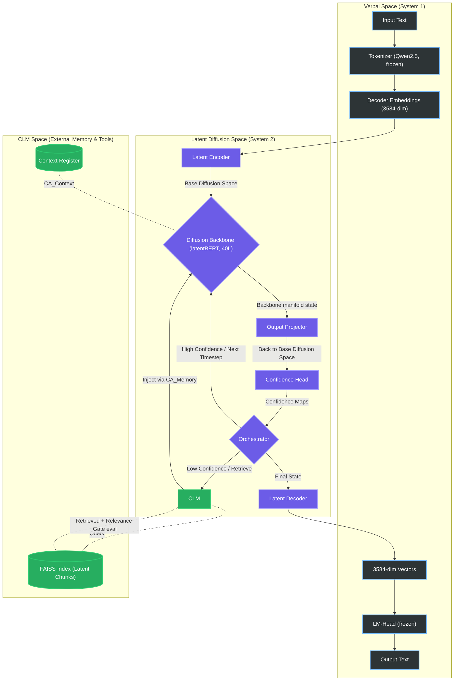

# Архитектура BEBLaDII (Reasoning Latent Diffusion)

BEBLaDII (Bidirectional Encoder Based Latent Diffusion with Information Injection) — это модульная система, реализующая принцип «Разумной Диффузии» путем разделения процессов логического анализа (System 2) и лингвистической генерации (System 1). Информация проходит через несколько ключевых этапов: от сырого текста до латентного рассуждения, взаимодействия с внешней памятью и возврата обратно в текст.

Данный документ описывает архитектуру версии 2.0 (согласно ADR-020).

---

## 1. Операционные пространства

| Пространство | Размерность | Описание |
|---|---|---|
| **Verbal Space** (System 1) | 3584-dim | Дискретные токены и эмбеддинги замороженного LLM (Qwen2.5). Точка входа и выхода. |
| **Latent Diffusion Space** (System 2) | 1024-dim | Непрерывное гауссово пространство «облаков смыслов». Базовое пространство, генерируемое Latent Encoder-ом. Здесь происходит оценка уверенности и маршрутизация. |
| **Backbone Manifold** | 1024-dim | Внутреннее пространство генерации, в которое уводит векторы Diffusion Backbone. Возврат из него осуществляется через Output Projector. |
| **CLM Search Space** | 1024-dim | Пространство запросов к внешней памяти. После компонента Index Mapper — контрастное пространство, оптимизированное для ANN-поиска. |

---

## 2. Граф вычислений


```mermaid
graph TD
    classDef verbal fill:#2d3436,stroke:#74b9ff,stroke-width:2px,color:#fff
    classDef latent fill:#6c5ce7,stroke:#a29bfe,stroke-width:2px,color:#fff
    classDef clm fill:#27ae60,stroke:#2ecc71,stroke-width:2px,color:#fff

    subgraph "Verbal Space (System 1)"
        A["Input Text"] --> B["Tokenizer (Qwen2.5, frozen)"]
        B --> C["Decoder Embeddings (3584-dim)"]
        K["3584-dim Vectors"] --> L["LM-Head (frozen)"]
        L --> M["Output Text"]
    end

    subgraph "Latent Diffusion Space (System 2)"
        C --> D["Latent Encoder"]
        D -->|"Base Diffusion Space"| E{"Diffusion Backbone (latentBERT, 40L)"}
        
        E -->|Backbone manifold state| OP["Output Projector"]
        OP -->|"Back to Base Diffusion Space"| F["Confidence Head"]
        
        F -->|"Confidence Maps"| G{"Orchestrator"}
        G -->|"High Confidence / Next Timestep"| E
        G -->|"Low Confidence / Retrieve"| H["CLM"]
        H -->|"Inject via CA_Memory"| E
        G -->|"Final State"| J["Latent Decoder"]
        J --> K
    end

    subgraph "CLM Space (External Memory & Tools)"
        H -.-|"Query"| I[("FAISS Index (Latent Chunks)")]
        I -.-|"Retrieved + Relevance Gate eval"| H
        TC[("Context Register")] -.-|"CA_Context"| E
    end

    class A,B,C,K,L,M verbal
    class D,E,F,G,J,OP latent
    class H,I,TC clm
```

---

## 3. Детальное описание компонентов

### Система входа и выхода (System 1)
- **Tokenizer**: Замороженный эмбеддинговый слой Qwen2.5. Преобразует входной текст в 3584-dim векторы.
- **Latent Decoder**: Обратный мост (MLP), проецирующий финальные 1024-dim латенты обратно в 3584-dim пространство замороженного LM-Head.
- **LM-Head**: Замороженная финальная голова Qwen2.5, декодирующая 3584-dim векторы в текст.

### Ядро диффузии (System 2)
- **Latent Encoder**: MLP-мост (3584→1024) + VAE-головы (`mu_head`, `logvar_head`). Нормализует пространство для диффузии через reparameterization trick. Создаёт **Базовое пространство диффузии**. Энкодер является общим (shared) с CLM и Context Register.
- **Diffusion Backbone (latentBERT)**: Модернизированный ModernBERT, расширенный до 40 слоёв через DUS (Depth Up-Scaling). Интегрирует 3 типа Cross-Attention слоёв через gated residual (`z_out = z_in + σ(γ) · CA(z_in, context)`):
  - **CA_Prompt**: внедряет исходный промпт (жёсткий критерий качества).
  - **CA_Memory**: внедряет факты из CLM.
  - **CA_Context**: внедряет данные из операционного Context Register.
- **Output Projector**: Возвращает вектор из внутреннего многообразия Backbone обратно в чистое базовое пространство диффузии. Необходим для замыкания цикла и корректной оценки метрик.
- **Confidence Head**: Лёгкий MLP с sigmoid. Вычисляет метрику прогресса диффузии (confidence score) для каждого латентного токена, измеряя степень его «кристаллизации».
- **Orchestrator**: Детерминированная Python-логика. Читает confidence map от Confidence Head и управляет всем процессом (продолжать диффузию, запросить память, переключить режим инструмента, сделать шаг Time-Travel или Dynamic Dilation).

### Внешняя память и инструменты (CLM & Context)
- **CLM (Complementary Latent Memory)**: База строгих фактов. Состоит из:
  - **Pooling**: Сжимает последовательность латентных токенов в вектор-запрос.
  - **Index Mapper**: Геометрическое преобразование (whitening/centering) вектора-запроса под ANN-поиск.
  - **FAISS Index**: Векторная база данных латентных чанков.
  - **Relevance Gate**: Нейронный слой (MLP), оценивающий релевантность найденных чанков. Способен выдать `null_clm_embedding` (сигнал отсутствия информации).
- **Context Register**: Операционный справочник, наполняемый в процессе работы (инструменты, MCP-серверы, пути к файлам). Это строго структурированная, точная адресуемая БД. Данные передаются в модель через `CA_Context`.

---

## 4. Анатомия одного шага диффузии

```text
                    ┌───────────────────────────────────────────────┐
                    │                   ОДИН ШАГ t                  │
                    │                                               │
   x_t ────────────▶│                latentBERT                     │──────▶ h_t (manifold)
 (Base Space)       │  (FA + CA_Prompt + CA_Memory + CA_Context)    │
                    └───────────────────────────────────────────────┘
                                                                       │
                                            ┌──────────────────────────┘
                                            ▼
                    ┌───────────────────────────────────────────────┐
                    │             Output Projector                  │
                    │  Возврат в Base Diffusion Space               │──────▶ x̂₀ (Base Space)
                    └───────────────────────────────────────────────┘
                                            │
                                            ▼
                    ┌───────────────────────────────────────────────┐
                    │             Confidence Head                   │
                    │  Выдаёт карту уверенности: conf ∈ [0,1]       │
                    └───────────────────────────────────────────────┘
                                            │
                                            ▼
                    ┌───────────────────────────────────────────────┐
                    │               Orchestrator                    │
                    │  Логика принятия решений на основе conf:      │
                    │  • продолжать диффузию (x_{t-1} = x̂₀ + noise) │
                    │  • обновить CA_Memory (поиск в CLM)           │
                    │  • обратиться к Context Register              │
                    └───────────────────────────────────────────────┘
                           │                          │
                   продолжить                    память / инструмент
                           │                          │
                   следующий шаг ─────────────────────▶
```

### Природа каждого компонента

| Компонент | Тип | Параметры | Обучается |
|---|---|---|---|
| Diffusion Backbone | Нейросеть (тяжёлая) | Много | Фаза 2 |
| Output Projector | Нейросеть (лёгкая) | Средне | Фаза 3 |
| Confidence Head | Нейросеть (лёгкая) | Мало | Фаза 7 |
| Relevance Gate | Нейросеть (лёгкая) | Мало | Фаза 9 |
| Orchestrator | Python-логика | Нет | Нет (только гиперпараметры) |
